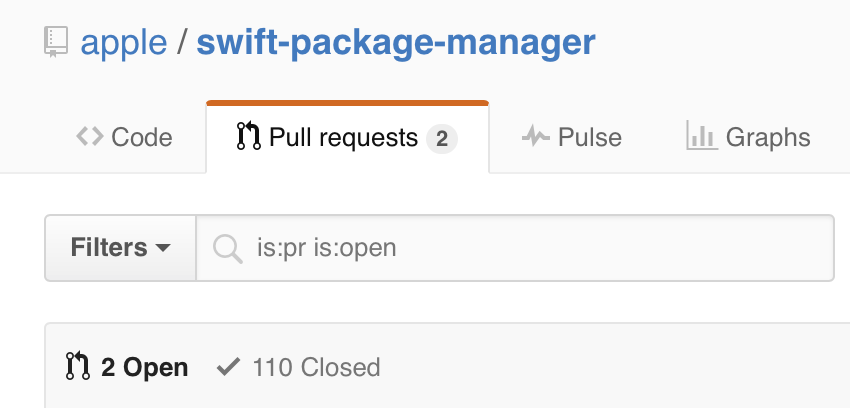
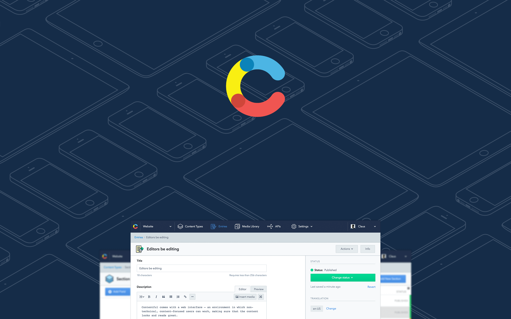

# Swift Package Manager

## dotSwift, January 2016

### Boris Bügling - @NeoNacho


<!--- use Next theme, white -->

---

# What is swiftpm?

---



---

# What does it do?

- Compiles and links Swift packages
- Resolves, fetches and builds their dependencies

---

# Current state

- Currently builds static libraries or binaries
- Supported platforms are OS X and Ubuntu Linux
- Only builds Swift code, no C/C++/Objective-C/...

---

```swift
import PackageDescription

let package = Package(
    name: "Hello",
    dependencies: [
        .Package(url: "ssh://git@example.com/Greeter.git", 
          versions: Version(1,0,0)..<Version(2,0,0)),
    ]
)
```

---

```bash
$ swift build
Compiling Swift Module 'Clock' (2 sources)
Linking Library:  .build/debug/Clock.a
```

---

# Integrate system libraries

- Empty `Package.swift`
- `module.modulemap`:

```
module curl [system] {
    header "/usr/include/curl/curl.h"
    link "curl"
    export *
}
```

---

```
let package = Package(
    name: "example",
    dependencies: [
        .Package(url: "https://github.com/neonichu/curl",
          majorVersion: 1)
    ]
)
```

---

# Making our own package

---

# 🕕

A small library for parsing and writing ISO8601 date strings.

---

```
Sources/
└── Clock
    ├── ISO8601Parser.swift
    └── ISO8601Writer.swift

1 directory, 2 files
```

---

```bash
$ touch Package.swift
$ swift build
```

---

## Tests?

---

# Spectre

```swift
describe("a person") {
  let person = Person(name: "Kyle")

  $0.it("has a name") {
    try expect(person.name) == "Kyle"
  }

  $0.it("returns the name as description") {
    try expect(person.description) == "Kyle"
  }
}
```

---

# spectre-build

```bash
$ swift build
$ .build/debug/spectre-build
-> a person
  -> has a name
  -> returns the name as description

2 passes and 0 failures
```

---

```swift
import PackageDescription

let package = Package(
  name: "Clock",
  testDependencies: [
    .Package(url: "https://github.com/neonichu/spectre-build.git",
      majorVersion: 0),
  ]
)
```

---

```bash
$ swift build
[...]
$ ./.build/debug/spectre-build
-> Converting dates to strings
  -> can convert NSDate to an ISO8601 GMT string

-> Parsing of localtime dates
  -> can parse dates
  -> can parse dates with negative timezone offsets
  -> can parse timezone offsets without colons

-> Parsing of UTC dates
  -> can parse dates
  -> can parse epoch
  -> can parse dates without seconds
  -> is resilient against Y2K bugs

8 passes and 0 failures
```

---

# Swift versions

```bash
$ cat .swift-version 
swift-2.2-SNAPSHOT-2015-12-22-a
```

- Is read by either `chswift` or `swiftenv`

---

# Travis CI

```haml
os:
- linux
- osx
language: generic
sudo: required
dist: trusty
osx_image: xcode7.2
install:
- curl -sL https://gist.github.com/kylef/
5c0475ff02b7c7671d2a/raw/
621ef9b29bbb852fdfd2e10ed147b321d792c1e4/swiftenv-install.sh | bash
script:
- . ~/.swiftenv/init
```

---

# Git tagging

- `Package.swift` only supports tagged dependencies
- Don't forget to push your tags to GitHub

---

> You should think of it as an alpha code base that hasn't had a release yet. Yes, it is useful for doing some things [...]
-- Daniel Dunbar

---

# Thank you!

@NeoNacho

boris@contentful.com

http://buegling.com/talks


