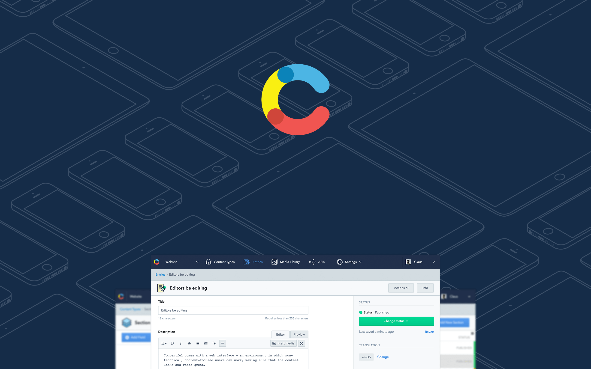

# Swift Package Manager

## swift.berlin #14, January 2016

### Boris Bügling - @NeoNacho


<!--- use Next theme, white -->

---

## CocoaPods


---

## Contentful



---

# Agenda

- What is swiftpm?
- Making our own package
- How does it work?
- Comparison with related tools

---

# What is swiftpm?

---

```swift
import PackageDescription

let package = Package(
    name: "Hello",
    dependencies: [
        .Package(url: "ssh://git@example.com/Greeter.git", 
          versions: Version(1,0,0)..<Version(2,0,0)),
    ]
)
```

---

```bash
$ swift build
Compiling Swift Module 'Clock' (2 sources)
Linking Library:  .build/debug/Clock.a
```

---

# What does it do?

- Compiles and links Swift packages
- Resolves, fetches and builds their dependencies

---

# Current state

- Currently builds static libraries or binaries
- Supported platforms are OS X and Ubuntu Linux
- Only builds Swift code, no C/C++/Objective-C/...

---

```bash
$ swift build --help
OVERVIEW: Build sources into binary products

USAGE: swift build [options]

MODES:
  --configuration <value>  Build with configuration (debug|release) [-c]
  --clean                  Delete all build intermediaries and products [-k]

OPTIONS:
  --chdir <value>    Change working directory before any other operation [-C]
  -v                 Increase verbosity of informational output
```

---


---

# Making our own package

---

# 🕕

A small library for parsing and writing ISO8601 date strings.

---

```
Sources/
└── Clock
    ├── ISO8601Parser.swift
    └── ISO8601Writer.swift

1 directory, 2 files
```

---

```bash
$ touch Package.swift
$ swift build
```

---

## Tests?

---

# Spectre

```swift
describe("a person") {
  let person = Person(name: "Kyle")

  $0.it("has a name") {
    try expect(person.name) == "Kyle"
  }

  $0.it("returns the name as description") {
    try expect(person.description) == "Kyle"
  }
}
```

---

# spectre-build

```bash
$ swift build
$ .build/debug/spectre-build
-> a person
  -> has a name
  -> returns the name as description

2 passes and 0 failures
```

---

```swift
import PackageDescription

let package = Package(
  name: "Clock",
  testDependencies: [
    .Package(url: "https://github.com/neonichu/spectre-build.git",
      majorVersion: 0),
  ]
)
```

---

```makefile
BUILD_DIR=./.build/debug

.PHONY: clean lib test

test: lib
  $(BUILD_DIR)/spectre-build

clean:
  swift build --clean

lib:
  swift build
```

---

```bash
$ make test
swift build
./.build/debug/spectre-build
-> Converting dates to strings
  -> can convert NSDate to an ISO8601 GMT string

-> Parsing of localtime dates
  -> can parse dates
  -> can parse dates with negative timezone offsets
  -> can parse timezone offsets without colons

-> Parsing of UTC dates
  -> can parse dates
  -> can parse epoch
  -> can parse dates without seconds
  -> is resilient against Y2K bugs

8 passes and 0 failures
```

---

# Swift versions

```bash
$ cat .swift-version 
swift-2.2-SNAPSHOT-2015-12-22-a
```

- Is read by either `chswift` or `swiftenv`

---

# Travis CI

```haml
os:
- linux
- osx
language: generic
sudo: required
dist: trusty
osx_image: xcode7.2
install:
- curl -sL https://gist.github.com/kylef/
5c0475ff02b7c7671d2a/raw/
621ef9b29bbb852fdfd2e10ed147b321d792c1e4/swiftenv-install.sh | bash
script:
- . ~/.swiftenv/init
```

---

# Git tagging

- `Package.swift` only supports tagged dependencies
- Don't forget to push your tags to GitHub

---

# CocoaPods

- `chocolat-cli` converts `Package.swift` to a JSON Podspec

---

```swift
public func parse_package(packagePath: String) throws -> PackageDescription.Package {
  // FIXME: We depend on `chswift` installation and use here
  let toolchainPath = PathKit.Path(POSIX.getenv("CHSWIFT_TOOLCHAIN") ?? "")
  libc.setenv("SPM_INSTALL_PATH", toolchainPath.parent().description, 1)
  print_if("Using libPath \(Resources.runtimeLibPath)", false)

  let package = (try Manifest(path: packagePath)).package
  print_if("Converting package \(package.name) at \(packagePath)", false)

  return package
}
```

---

# Side-note about Linux

---

Foundation is incomplete and sometimes different from OS X:

```swift
#if os(Linux)
      let index = p.startIndex.distanceTo(p.startIndex.successor())
      path = NSString(string: p).substringFromIndex(index)
#else
      path = p.substringFromIndex(p.startIndex.successor())
#endif
```

---

Some things in the standard library might not be available:

```objectivec
#if _runtime(_ObjC)
// Excluded due to use of dynamic casting and Builtin.autorelease, neither
// of which correctly work without the ObjC Runtime right now.
// See rdar://problem/18801510
[...]
public func getVaList(args: [CVarArgType]) -> CVaListPointer {
```

---

OS X libc and Glibc can differ:

```swift
let flags = GLOB_TILDE | GLOB_BRACE | GLOB_MARK
    if system_glob(cPattern, flags, nil, &gt) == 0 {
#if os(Linux)
      let matchc = gt.gl_pathc
#else
      let matchc = gt.gl_matchc
#endif
```

---

And other random fun:

```
./.build/debug/spectre-build
/usr/bin/ld: .build/debug/Clock.a(ISO8601Parser.swift.o): 
undefined reference to symbol '_swift_FORCE_LOAD_$_swiftGlibc'
/home/travis/.swiftenv/versions/swift-2.2-SNAPSHOT-2015-12-22-a/
usr/lib/swift/linux/libswiftGlibc.so: error adding symbols: DSO 
missing from command line
clang: error: linker command failed with exit code 1 (use -v to see invocation)
```

---

# Integrate system libraries

- Empty `Package.swift`
- `module.modulemap`:

```
module curl [system] {
    header "/usr/include/curl/curl.h"
    link "curl"
    export *
}
```

---

```
let package = Package(
    name: "example",
    dependencies: [
        .Package(url: "https://github.com/neonichu/curl",
          majorVersion: 1)
    ]
)
```

---

# How does it work?

---

## Modules inside SwiftPackageManager

- OS abstractions: `libc`, `POSIX`, `sys`
- Package: `PackageDescription`
- Manifest: `dep`
- Downloading code: `swift-get`
- Building code: `swift-build`

---

# Dependencies

- Can be local or remote Git repositories
- Need to be tagged
- Will be fetched to `./Packages/MyPackage-0.0.1`

---

# Rough build process

- `PackageDescription` generates TOML
- `dep` parses the TOML and can generate YAML
- Dependencies are fetched by `swift-get`
- YAML is used as input to `llbuild`
- `swift-build` calls out to `llbuild`

---

# llbuild

---

```
$ cat .build/debug/Clock.o/llbuild.yaml 
client:
  name: swift-build

tools: {}

targets:
  "": [<Clock>]
  Clock: [<Clock>]
```

---

```
commands:
  <Clock-swiftc>:
    tool: swift-compiler
    executable: "/usr/bin/swiftc"
    inputs: ["ISO8601Parser.swift","ISO8601Writer.swift"]
    outputs: ["<Clock-swiftc>","Clock.swiftmodule",
    "ISO8601Parser.swift.o","ISO8601Writer.swift.o"]
    module-name: "Clock"
    module-output-path: "Clock.swiftmodule"
    is-library: true
    sources: ["ISO8601Parser.swift","ISO8601Writer.swift"]
    objects: ["ISO8601Parser.swift.o","ISO8601Writer.swift.o"]
    import-paths: ["/Users/boris/Projects/Clock/.build/debug"]
    temps-path: "/Users/boris/Projects/Clock/.build/debug/Clock.o/Clock"
    other-args: ["-j8","-Onone","-g","-target","x86_64-apple-macosx10.10",
    "-enable-testing","-sdk",
    "/.../Developer/SDKs/MacOSX10.11.sdk","-I","/usr/local/include"]
```

---

```
  <Clock>:
    tool: shell
    inputs: ["<Clock-swiftc>","ISO8601Parser.swift.o","ISO8601Writer.swift.o"]
    outputs: ["<Clock>","Clock.a"]
    args: ["/bin/sh","-c","rm -f 'Clock.a'; 
    ar cr 'Clock.a' 'ISO8601Parser.swift.o' 'ISO8601Writer.swift.o'"]
    description: "Linking Library:  .build/debug/Clock.a"
```

---

# Additional Package.swift syntax

---

# Targets

```swift
import PackageDescription

let package = Package(
    name: "Example",
    targets: [
        Target(
            name: "top",
            dependencies: [.Target(name: "bottom")]),
        Target(
            name: "bottom")
    ]
)
```

---

# Exclusion

```swift
let package = Package(
    name: "Example",
    exclude: ["tools", "docs", "Sources/libA/images"]
)
```

---

# Test dependencies

```swift
import PackageDescription

let package = Package(
    name: "Hello",
    testDependencies: [
        .Package(url: "ssh://git@example.com/Tester.git",
          versions: Version(1,0,0)..<Version(2,0,0)),
    ]
)
```

---

# Customizing builds

```swift
import PackageDescription

var package = Package()

#if os(Linux)
let target = Target(name: "LinuxSources/foo")
package.targets.append(target)
#endif
```

---

# Comparison with related tools

---

# CocoaPods

- Centralized discovery
- Xcode integration
- Support for other languages
- Additional metadata in the Manifest
- Does not cover the build process

---

# Carthage

- No manifest for packages
- Xcode integration
- Support for other languages

---

# Support all three

- `Package.swift`
- `.podspec`
- `.xcodeproj` / `.xcworkspace`

---

# 😢

---

> You should think of it as an alpha code base that hasn't had a release yet. Yes, it is useful for doing some things [...]
-- Daniel Dunbar

---

## References

- <https://swift.org>
- <https://github.com/apple/swift-package-manager>
- <https://github.com/apple/llbuild>
- <https://github.com/neonichu/chocolat>
- <https://github.com/neonichu/chswift>
- <https://github.com/neonichu/freedom>
- <https://github.com/kylef/spectre-build>
- <https://github.com/kylef/swiftenv>

---

# Thank you!


---

@NeoNacho

boris@contentful.com

http://buegling.com/talks


